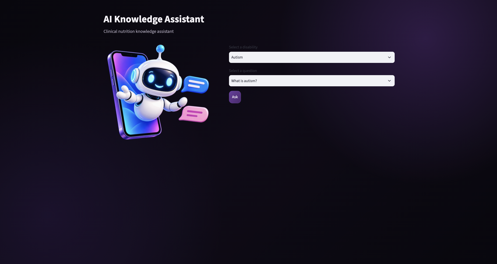
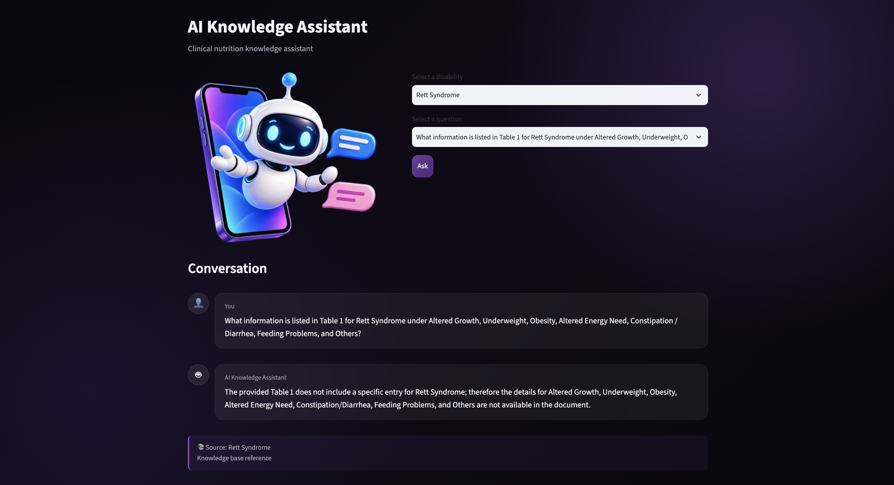

# AI Knowledge Assistant

A document-based Retrieval-Augmented Generation (RAG) system built as a hands-on AI engineering project.

The project processes a PDF document, extracts and chunks its content, generates embeddings, performs semantic vector search, builds an LLM-ready context, and generates grounded answers using an LLM.

The system is developed incrementally, with each stage focusing on a specific part of a modern RAG pipeline.

---

## 1. Project Goal

The main goal of this project is to build a practical AI knowledge assistant that can answer questions from a provided document while reducing unsupported or hallucinated answers.

The current knowledge source is a PDF containing information about children with special food and nutrition needs.

The project focuses on understanding and implementing the individual components of a RAG system rather than treating RAG as a black-box framework.

---

## 2. Current Status

The project currently includes the following stages:

- PDF loading and text extraction
- Page cleaning
- Printed book-page mapping
- Semantic chunking
- Section tracking across pages
- Chunk inspection and testing
- Text embeddings
- Vector indexing with FAISS
- Semantic similarity search
- Retrieval thresholding
- Context construction
- Table-aware context formatting
- Grounded prompt construction
- LLM-based answer generation
- End-to-end RAG pipeline
- FastAPI backend
- Streamlit-based user interface
- Environment-based API configuration
- Automated testing with pytest

The RAG pipeline has been tested with:

- Regular document text
- Table-based information
- Questions whose answers are not available in the provided context
- Different retrieval and similarity thresholds

The project also includes a local PDF knowledge source, a reproducible project setup, and documentation for running the system locally.

---

## 3. Architecture

The system is organized into several layers: a Streamlit user interface, a FastAPI backend, and the underlying RAG pipeline.

The overall application flow is:

```text
User
 │
 ▼
┌──────────────────┐
│ Streamlit UI     │
└────────┬─────────┘
         │ HTTP request
         ▼
┌──────────────────┐
│ FastAPI Backend  │
└────────┬─────────┘
         │
         ▼
┌──────────────────┐
│ RAG Pipeline     │
└────────┬─────────┘
         │
         ▼
   Retrieval Layer
         │
         ▼
   Context Builder
         │
         ▼
        LLM
         │
         ▼
      Answer
```

The internal RAG pipeline follows this flow:

```text
                    PDF Document
                         │
                         ▼
                  ┌──────────────┐
                  │ PDF Loader   │
                  └──────┬───────┘
                         │
                         ▼
                  ┌──────────────┐
                  │   Chunker    │
                  └──────┬───────┘
                         │
                         ▼
                       Chunks
                         │
                         ▼
                  ┌──────────────┐
                  │  Embedder    │
                  └──────┬───────┘
                         │
                         ▼
                    Embeddings
                         │
                         ▼
                  ┌──────────────┐
                  │ Vector Store │
                  │    FAISS     │
                  └──────┬───────┘
                         │
                         ▼
User Question ───► Retriever
                         │
                         ▼
                 Relevant Chunks
                         │
                         ▼
                  Context Builder
                         │
                         ▼
                       Prompt
                         │
                         ▼
                       LLM
                         │
                         ▼
                      Answer
```

The separation between the UI, API layer, retrieval components, and LLM components keeps the system modular and makes individual stages easier to test and develop independently.

---

## 4. Ingestion Pipeline

The ingestion layer is responsible for converting the source PDF into structured chunks that can later be embedded and searched.

### 4.1 PDF Loading

`app/ingestion/loader.py`

Responsibilities include:

- Reading the PDF
- Extracting text from each page
- Removing repeated header and footer content
- Removing standalone page numbers
- Mapping PDF page numbers to printed book page numbers
- Creating `DocumentPage` objects

The loader preserves both:

- PDF page number
- Printed book page number

This allows retrieved answers to retain document-level references.

### 4.2 Chunking

`app/ingestion/chunker.py`

The chunker converts document pages into semantic chunks.

The current chunking process also preserves section information across pages.

A section detected on one page can remain active for subsequent pages until another section is detected.

Chunk metadata includes information such as:

- Chunk ID
- Section
- PDF page
- Book page
- Source
- Text

---

## 5. Embeddings

`app/ingestion/embedder.py`

Text chunks are converted into numerical vector representations using a sentence-transformer embedding model.

The purpose of embeddings is to represent semantic meaning numerically so that semantically similar text can be compared even when the wording is not identical.

The project uses cosine similarity for comparing query and chunk embeddings.

Conceptually:

```text
Question
   ↓
Embedding
   ↓
Vector

Document Chunk
   ↓
Embedding
   ↓
Vector

Vector comparison
   ↓
Similarity score
```

Embeddings are generated during the indexing process and are later used to represent incoming user questions during retrieval.

---

## 6. Vector Search

The project uses FAISS for vector indexing and similarity search.

Relevant components include:

```text
app/ingestion/vector_store.py
app/ingestion/retriever.py
build_vector_index.py
search_faiss.py
```

The retrieval process is:

```text
User Question
      ↓
Question Embedding
      ↓
Vector Search
      ↓
Similarity Scores
      ↓
Top-k Results
      ↓
Similarity Threshold
      ↓
Relevant Chunks
```

The retriever returns chunks together with their similarity scores.

This separates retrieval from answer generation.

The LLM does not search the document directly. It receives the context selected by the retrieval layer.

## The retrieval layer also supports configurable similarity thresholds and section-aware retrieval, allowing the system to filter out weak or irrelevant matches before constructing the final context.

## 7. Context Construction

`app/llm/context.py`

Retrieved chunks need to be converted into a structured context before being sent to the LLM.

The context currently preserves information such as:

- Section
- Book page
- Similarity
- Content

The context builder also handles table content differently from ordinary prose.

### Table-aware Context

Some information in the source document is represented as tables.

A table may contain relationships such as:

```text
Row: Cerebral Palsy

Column: Feeding Problems

Value:
Oral / Motor Problems
inability to self-feed
Swallowing incoordination
```

The table-aware context representation makes these row/column relationships clearer to the LLM.

This is important because simply passing a very wide table as raw text did not reliably produce the desired answer.

---

## 8. Grounded Prompt

`app/llm/prompt.py`

The prompt instructs the LLM to answer using only the retrieved context.

The current grounding rules include:

- Answer only from the provided context.
- Do not add information from general knowledge.
- Do not repeat the entire context.
- Give a concise and direct answer.
- Treat tables as structured data.
- When answering a table question, identify the requested row and column.
- If the requested information is not present, state that it is not available.

The goal is to keep generated answers grounded in the retrieved document content and reduce unsupported responses.

---

## 9. RAG Pipeline

`app/llm/rag.py`

The `RAGPipeline` class connects the retrieval and generation stages.

The current flow is:

```text
Question
   ↓
Retriever
   ↓
Relevant Chunks
   ↓
Context Builder
   ↓
Prompt Builder
   ↓
LLM Client
   ↓
Answer
```

The application can therefore process a question through the complete RAG pipeline using a single interface.

Conceptually:

```python
answer = rag.answer(question)
```

This means the caller does not need to manually execute the individual retrieval, context construction, and generation steps.

The pipeline also exposes a streaming-oriented generation path used by the API layer, while the main application interface remains compatible with standard answer generation.

---

## 10. Current Capabilities

The current system can:

- Extract content from the source PDF
- Preserve document page metadata
- Split content into semantic chunks
- Generate embeddings
- Build a FAISS vector index
- Search chunks using semantic similarity
- Apply similarity thresholds
- Perform section-aware retrieval
- Build an LLM-ready context
- Handle table-based context
- Generate grounded answers
- Refuse to provide information when the retrieved context does not contain the requested information
- Expose the RAG pipeline through a FastAPI backend
- Provide a Streamlit-based user interface
- Run automated tests with pytest

---

## 11. Screenshots

### Streamlit Interface



### Search Results



## 12. Testing

The project includes automated tests for the main components and additional scripts for manual inspection and RAG evaluation.

### Automated Tests

Automated tests are located in:

```text
tests/
├── test_chunker.py
├── test_embedder.py
├── test_ingestion.py
├── test_llm.py
├── test_loader.py
├── test_pipeline.py
└── test_query_rewriter.py
```

Pytest is configured through `pytest.ini` to collect automated tests from the `tests/` directory. This keeps the automated tests separate from the manual development and inspection scripts in the project root.

Run all automated tests with:

```bash
PYTHONPATH=. pytest
```

The current test suite has been successfully executed with:

```text
21 passed
```

### Manual Testing and Inspection

The repository also contains scripts for manually inspecting individual pipeline stages and evaluating RAG behavior:

```text
inspect_chunks.py
inspect_ingestion.py
inspect_pdf.py
search_faiss.py
test_context.py
test_metadata_filter.py
test_query_rewriter.py
test_rag_llm.py
test_tables.py
```

These scripts are intended for development and manual evaluation rather than automated test discovery.

Manual RAG testing has included questions about:

- Cerebral Palsy
- Epilepsy / Seizure Disorder
- Feeding problems
- Table-based information
- Information not present in the source document

---

## 13. Project Structure

```text
.
├── app
│   ├── api
│   │   ├── main.py
│   │   ├── routes.py
│   │   └── schemas.py
│   │
│   ├── ingestion
│   │   ├── chunker.py
│   │   ├── embedder.py
│   │   ├── embedding_pipeline.py
│   │   ├── loader.py
│   │   ├── models.py
│   │   ├── pdf_models.py
│   │   ├── pipeline.py
│   │   ├── retriever.py
│   │   ├── storage.py
│   │   └── vector_store.py
│   │
│   └── llm
│       ├── client.py
│       ├── context.py
│       ├── prompt.py
│       ├── query_rewriter.py
│       └── rag.py
│
├── data
│   ├── documents
│   │   └── disabilities.pdf
│   └── processed
│       └── disabilities_chunks.json
│
├── tests
│   ├── test_chunker.py
│   ├── test_embedder.py
│   ├── test_ingestion.py
│   ├── test_llm.py
│   ├── test_loader.py
│   ├── test_pipeline.py
│   └── test_query_rewriter.py
│
├── ui
│   ├── app.py
│   ├── questions.py
│   ├── page_icon.png
│   └── robot.png
│
├── build_vector_index.py
├── embed_chunks.py
├── inspect_chunks.py
├── inspect_ingestion.py
├── inspect_pdf.py
├── save_chunks.py
├── search_faiss.py
├── test_context.py
├── test_metadata_filter.py
├── test_query_rewriter.py
├── test_rag_llm.py
├── test_tables.py
├── pytest.ini
├── requirements.txt
└── README.md
```

The project is organized into separate layers for API access, document ingestion, retrieval, LLM interaction, testing, and the user interface.

---

## 14. Environment

The project uses environment variables for external service configuration.

Create a local `.env` file from the provided example:

```bash
cp .env.example .env
```

Add your own Hugging Face token:

```text
HF_TOKEN=your_huggingface_token
```

The `.env` file contains secrets and must not be committed to Git.

The repository includes `.env.example` as a template so that each user can provide their own credentials.

---

## 15. Running the Project

### 15.1 Create the Environment

Create and activate a virtual environment:

```bash
python -m venv .venv
source .venv/bin/activate
```

Install the dependencies:

```bash
pip install -r requirements.txt
```

### 15.2 Configure Environment Variables

Create the local environment file:

```bash
cp .env.example .env
```

Then add your own `HF_TOKEN` to `.env`.

### 15.3 Prepare Embeddings

The repository includes the processed chunks, while embeddings are generated locally:

```bash
python embed_chunks.py
```

This creates:

```text
data/processed/disabilities_embeddings.json
```

### 15.4 Build the FAISS Index

After generating embeddings:

```bash
python build_vector_index.py
```

This creates:

```text
data/processed/disabilities.index
```

The embeddings and FAISS index are generated artifacts and do not need to be committed to the repository.

### 15.5 Run Automated Tests

Run the complete automated test suite:

```bash
PYTHONPATH=. pytest
```

### 15.6 Run the API

The FastAPI application is located under:

```text
app/api/main.py
```

Start the API with:

```bash
PYTHONPATH=. uvicorn app.api.main:app --reload
```

### 15.7 Run the Streamlit UI

Start the user interface with:

```bash
streamlit run ui/app.py
```

The PDF used by the project is included in:

```text
data/documents/disabilities.pdf
```

so the example project can be run without obtaining a separate source document.

---

## 16. Development Roadmap

The project was developed incrementally, with each stage focusing on a specific part of the RAG system.

### Completed

#### Document Ingestion

- PDF extraction
- Page handling
- Text cleaning
- Printed page mapping
- Semantic chunking
- Section tracking
- Ingestion testing

#### Embeddings and Retrieval

- Text embeddings
- Semantic similarity
- Cosine similarity
- Vector representation
- FAISS indexing
- Vector search
- Top-k retrieval
- Similarity thresholding
- Section-aware retrieval

#### RAG Pipeline

- RAG architecture
- Context construction
- Context injection
- Grounded prompting
- LLM answer generation
- Table-aware context
- Basic hallucination prevention
- Query rewriting

#### Application Layer

- FastAPI backend
- API request and response schemas
- Streamlit user interface
- Integration between the UI and RAG API
- Environment-based API configuration

#### Testing

- Automated component tests
- End-to-end pipeline tests
- Query rewriting tests
- Manual retrieval inspection
- Manual RAG evaluation
- Table-based question testing

### Planned

Possible future improvements include:

- Reliable end-to-end streaming in the user interface
- Improved retrieval strategies
- More robust table handling
- Retrieval evaluation
- Answer evaluation
- Conversation history
- Performance optimization
- Production-oriented RAG architecture
- Deployment

---

## 17. Design Principle

The project follows a modular approach.

Each major responsibility is isolated:

```text
Loader
   ↓
Chunker
   ↓
Embedder
   ↓
Vector Store
   ↓
Retriever
   ↓
Context Builder
   ↓
Prompt
   ↓
LLM
   ↓
API
   ↓
UI
```

This structure makes it possible to test, replace, and improve individual components without rewriting the entire system.

The goal is not only to build a working knowledge assistant, but also to understand how each component contributes to a complete RAG system.

The project therefore emphasizes:

- Modular design
- Separation of responsibilities
- Testability
- Grounded generation
- Explicit retrieval and context construction
- Understanding the underlying RAG components rather than relying entirely on a black-box framework

```

```
